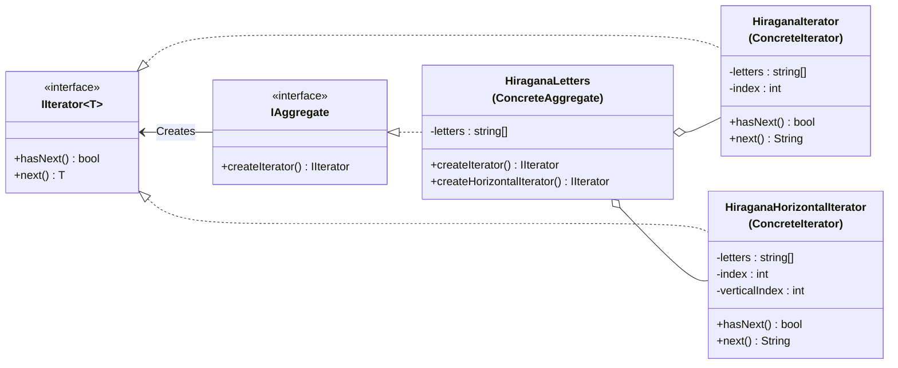

## クラス図

```mermaid
classDiagram
  direction LR
  class IIterator~T~ {
    <<interface>>
    +hasNext() bool
    +next() T
  }

  class IAggregate {
    <<interface>>
    +createIterator() IIterator
  }

  class HiraganaLetters["HiraganaLetters<br>(ConcreteAggregate)"] {
    -letters : string[]
    +createIterator() IIterator
    +createHorizontalIterator() IIterator
  }

  class HiraganaIterator["HiraganaIterator<br>(ConcreteIterator)"] {
    -letters : string[]
    -index : int
    +hasNext() bool
    +next() String
  }

  class HiraganaHorizontalIterator["HiraganaHorizontalIterator<br>(ConcreteIterator)"] {
    -letters : string[]
    -index : int
    -verticalIndex : int
    +hasNext() bool
    +next() String
  }

  IIterator <-- IAggregate : Creates
  IIterator <|.. HiraganaIterator
  IIterator <|.. HiraganaHorizontalIterator
  IAggregate <|.. HiraganaLetters
  HiraganaLetters o-- HiraganaIterator
  HiraganaLetters o-- HiraganaHorizontalIterator
```