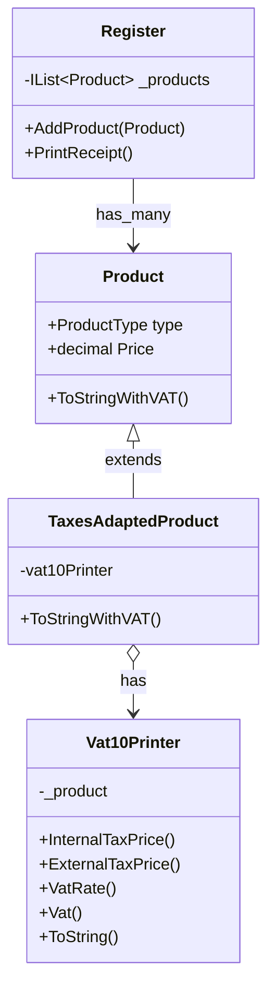

# Adapterパターン

すでに提供されている機能と求める出力の間に入って、そのギャップを埋めるAdapterを作成する。
AdapterはWrapperと呼ばれることもある。
## 2種類のAdapterパターン

- 継承を利用した、クラスによるAdapterパターン
- 委譲を利用した、インスタンスによるAdapterパターン

委譲タイプのほうが現代プログラミングに即していそう。

## 今回作成するシステム

各種税金計算システム

### シナリオ

消費税が8%から10%に増税された(一部の商品では8%のまま)
いままでは8%の内税方式で金額がレシートに印刷されていた。
また商品クラスProductに入っている金額`Price`には内税の金額しか入っていない(設計ミス)
これをAdapterを使い、外税方式かつ税率表示する。

実際のレシート印字処理(に用いる文字列生成)は委譲先のクラスにお任せしている。

### クラス図

