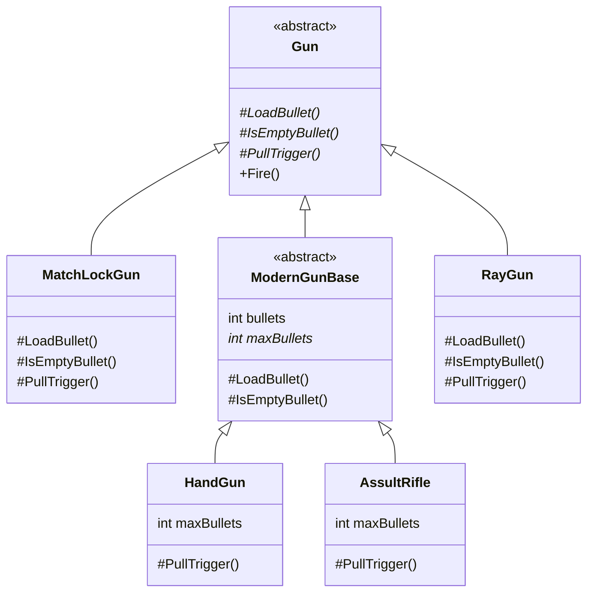

# TemplateMethodパターン

処理の大枠はテンプレートクラスに記載しておいて、具体的な実装内容は具象クラス側におまかせする。

## メリット

- 処理の共通化。同じような処理を行うが出力が異なるパターンを構造的に定義できる。
- 実装時に実装者ごとのクセや差異を減らし、コードリーディングの容易さ、技術的負債を減らせる
- それぞれの具象クラスをスーパークラスでくくることができる。どのような具象クラスでも、スーパークラスで定義されている`template_method`を実行すれば結果が出てくることを期待できる。

## サンプル:銃

TemplateClassには「撃つ」という動作のシーケンスだけ定義し、シーケンスの詳細はそれぞれの具象クラスにまかせている。
銃の種類が異なれば内部構造も異なるため。

### クラス図

