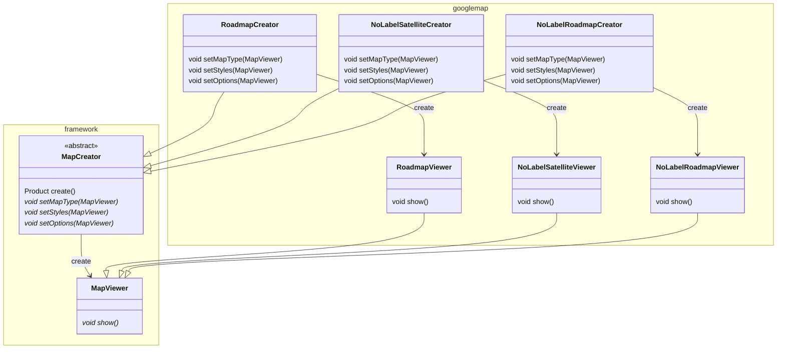

# FactoryMethod

- 抽象パッケージ `freamwork` にオブジェクトを生成するファクトリ`Factory`と生成物`Product`の抽象クラスを定義する。
- ファクトリ抽象クラスにはProductを生成するメソッド`create`を実装する。createする手順は固定で、createする際にコールするメソッドをabstractにする。
- 具体的にな実装は 具象パッケージ`concretePackage` 中に `framework` と同じ構成で具象クラスを実装し、abstraceにした具体的な処理内容はconcrete側に実装する
- サブクラスに実装を任せたabstractなメソッドのことを`FactoryMethod`と呼ぶ。
- `Creator`クラスが`Product`を生成する部分は`TemplateMethod`パターンが活用されている。

## メリット

- 生成物の追加が簡単。factoryの設計に基づいて抽象メソッドを実装すればフレームワークの再利用が容易。
- 生成物追加時にフレームワーク側の修正をする必要がない。

## デメリット

- `freamwork.Factory`側に実装した`create`を修正する必要が出た場合、傘下のファクトリーすべてに影響が及ぶ
- 最初のフレームワーク設計がバッチリ行えないと、後から修正が困難になる。設計力が問われる。

## 現実の実装

FactoryMethodパターンが単独で利用されることはほぼほぼなく、ほかのデザインパターンと組み合わせて実装されることが多い。
- 例:JDBC。connectionはファクトリーで生成されるが(少なくともプログラマからは)ConcreteFactoryに相当するクラスは見当たらない。

JDBCは`driverManager`に接続文字列を渡すと接続文字列からデータベースの種類に応じたConnectionクラスが返ってくる。
`driverManager`がbuliderかfacadeの役割を持っていて、その内部でFactoryを接続文字列に応じて呼んでいるような感じ。
ODBCもそんなかんじ。
Spring Fremewrok もそんなかんじ。
`ConcreteCreator`は隠蔽されることが多いのか。

## サンプル実装

