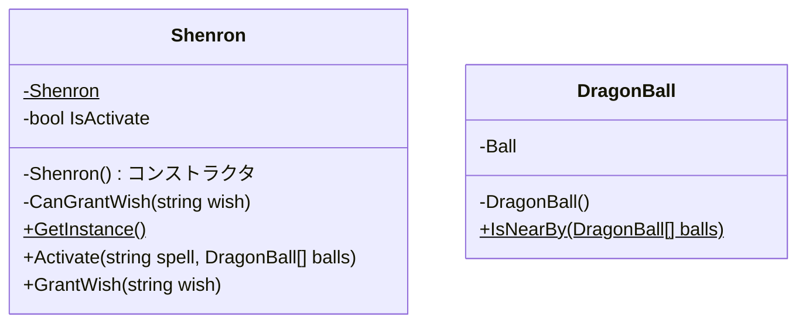

# Singleton

この世界にはインスタンスが1つしか存在できない!
この世界にはインスタンスが1つしか存在できないことを保証する!

というのがSingletonパターン

世界に1つしか存在しないもの、同一インスタンスで処理できなければ困る事象に対して適用するパターン
また、｢インスタンスは1つだけで、すべての処理で1つのインスタンスを使いまわして大丈夫｣という場合にも適用できる。

JavaやASP.NETのコントローラクラス、サービスクラスはこのSingletonで構成されている
(対照的にRailsのコントローラは都度インスタンスをNewしている)
Singletonであることを考慮しながら実装をすすめないと大きなしっぺ返しが発生する。
(下手にメンバ変数を実装するとすべての処理でメンバ変数の使いまわしができてしまう)

またWebシステムのように複数のユーザーから同時非同期に処理をすることになると、処理の順序や内部状態により不具合が発生する可能性がある。
内部状態は本当に必要なものでない限り持たせないのがSingletonクラスのセオリー(のはずなのだが…)

JavaのSimpleDateFormatが良い失敗例
(厳密にはSingletonではないがフォーマットの内部状態をクラス変数に持っていてスレッドセーフではない)

## 具体事例: 神龍システム

神龍は世界に1匹しかいないのでSingletonで表現する。
ドラゴンボールもそれぞれ世界に1つしかないのでSingletonで表現できる
(今回は簡略化のためにしない)

