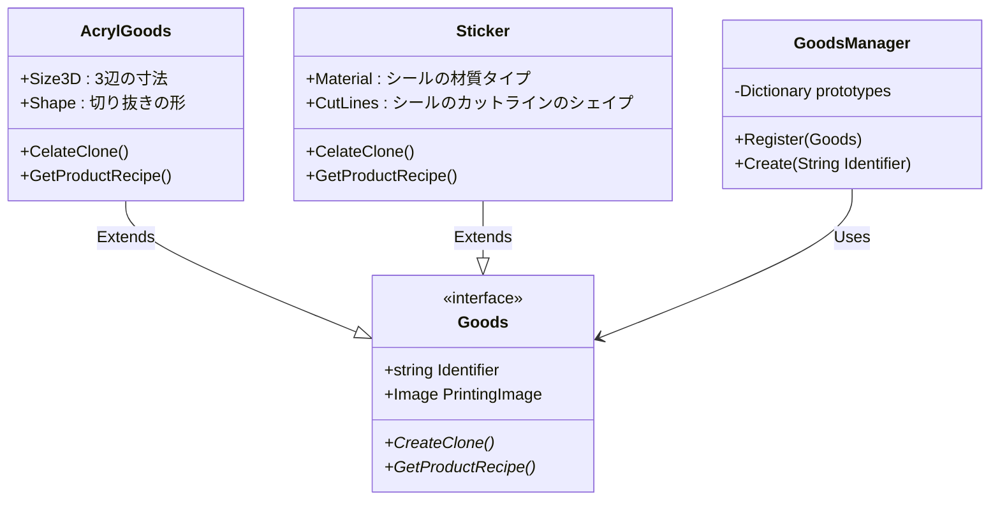

# Prototypeパターン

## 概要

模型となるインスタンスから別のインスタンスを複製して使用する

## 詳細

TemplateMethodパターン等と同じで、何かオブジェクトを作成する際に｢元となるなにか｣がクラスやインターフェースではなくインスタンス(オブジェクト)になる。
模型となるインスタンスから適切に複製を作るために `cleateClone`というメソッドを実装させるようにする
Javaではこのような複製が作れるよ、ということを表すインターフェースが仕組みとして備わっている(`java.lang.Cloneable`)

C#でも同様のインターフェースとして `System.ICloneable` が存在するが、自身のシャローコピーを返す `MemberwiseClone`メソッドがObjectに実装されている。
プロパティや外部からアクセス可能なメンバ変数だけをシャローコピーするので、ディープコピーしたければ自力で実装する必要がある。

https://learn.microsoft.com/ja-jp/dotnet/api/system.object.memberwiseclone?view=net-9.0

## 実装例

オリジナルグッズ販売管理システム

任意の画像が印刷されたアクリルキーホルダーやステッカーなどを管理する。
原型となるそれぞれのグッズのクラス(アクキークラス、ラバキークラス)があり、それぞれ形状を整えた(丸型だったり、星型だったり)プロトタイプをManagerに登録し、製造時にプロトタイプとして原型からCloneしてくることを想定する。

