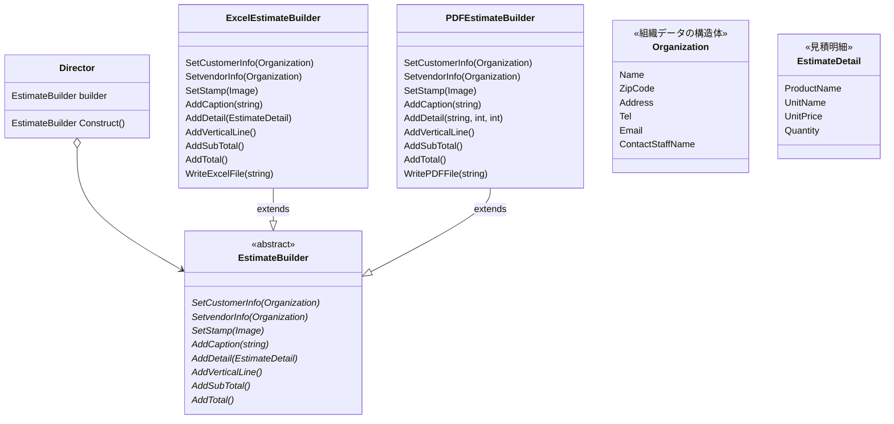

# Builderパターン

## 概要

### Director
後述するBuilderを使ってインスタンスを構築する役割を持つ。
Builderインターフェースしか知らない人。

### Builder
目的となるインスタンスを作成するためのインターフェース(API)を定義する。

### ConcreteBuilder
Builderインターフェースの具体的実装。APIの中身を実装する。
また、最終的な結果を得るメソッドを提供する。

つまり、Director は インスタンスを構築する役割だけ持ち、その最終結果までには感知しない。

書籍のサンプルでも、最終結果はプレインテキストとHTMLと結果の形が異なるし、コンソール出力するかもしれないしファイルに保存するかもしれない。
最終結果の処理方法はDirectorの責務にしない。

ディレクターは番組の映像を作成するまでで、それをテレビで放送するかネットで配信するかDVDで発売するかは別の人(プロデューサー?)の役目と置き換えるとわかりやすそう?

## サンプル:見積書作成システム

見積書にはいくつかの体裁がある。見積書作成クラスを抽象化したbuilder、体裁ごとに具体的なBuilderクラスを作成する。

