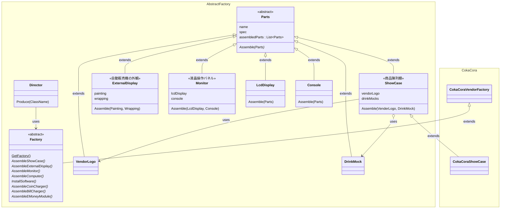

# AbstractFactory

オブジェクトの製造主体(Factory)も製造に必要な部品要素(Product)も抽象化し、ユーザーはAPIだけに注目する

## サンプルシステム

自動販売機製造工場

本工場は複数の飲料メーカーに対し自動販売機を製造、販売する

自動販売機はメーカーごとに仕様等が異なるので、製造過程(Factory)をメーカーごとに抽象化し、製造に必要な部品も抽象化する。

自動販売機は内部構造はどのメーカーも同じで外見や中で稼働しているソフトウェアのみが異なるので、抽象化するのは内部構造以外の部分となる。

