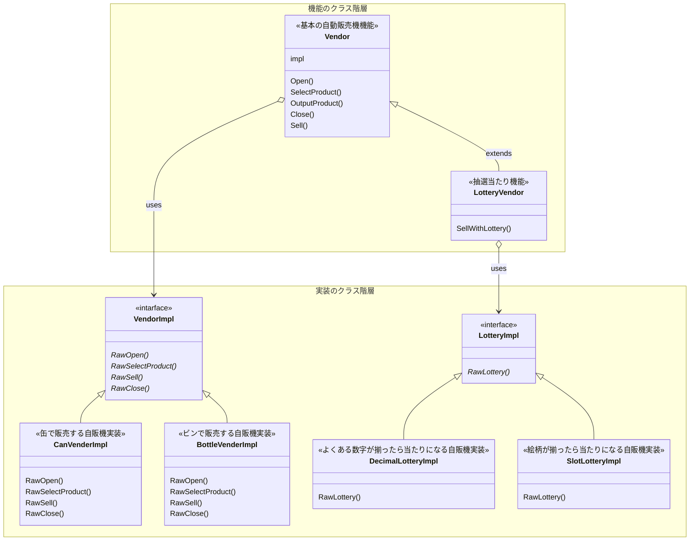

# Bridgeパターン

機能(API)は機能側のレイヤーに、実装(impl)は実装側のレイヤーに分ける

機能拡張や機能追加をしなければならない場合に、実装と機能定義を分けることで見通しの向上と修正箇所を小さくできる。

## 実装

自動販売機

今回は二種類の自動販売機を想定する。
- 一般的に見られる、缶飲料やペットボトル飲料を販売する自動販売機
- 銭湯の牛乳瓶自販機のような、商品を排出する際に底をネジネジする自販機

また、当たり機能付きの自販機をアドオンできるよう多段ブリッジしてみる
当たりの抽選方法も、7セグLEDの方法と絵柄スロットの方法の二種類を用意する。

