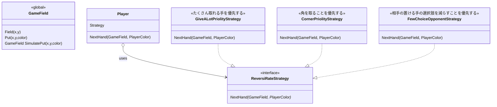

# Strategyパターン

アルゴリズムの差し替えを可能にする

実際の応用実装では、例えばListのsortメソッドで、内包している要素のカーディナリティや要素数によって最適なソートアルゴリズムを切り替えるようなパターンが利用されている。

## 例: リバーシ(オセロ)の戦略

リバーシの戦略をStrategyパターンで表現する

- とにかくたくさんひっくり返せる手を探す戦略(初級者向け)
- 角を取ることを優先する戦略(中級者向け)
- 相手の次の手の選択肢を減らすことを優先する戦略(上級者向け)

