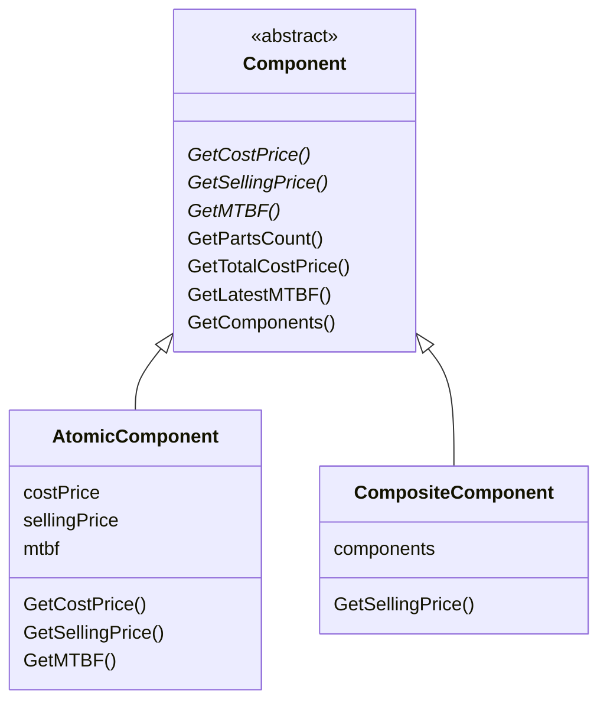

# Compositeパターン

｢単体｣と｢単体の集合｣を同じインターフェース上に実装する。

｢単体の集合｣には子要素として｢単体｣か｢単体の集合｣を入れられる。

特定の｢単体｣を探すには｢単体の集合｣を再帰的に探していくことで可能となる。

Leafが1つのNodeにたくさんつく木構造と考えれば良い。

## サンプル実装

ディレクトリエントリ以上に適切かつわかりやすいサンプルは思いつかない。。。

### 部品構成管理システム

ある製品がどの部品を使っているかを管理する。
部品はさらに別の部品によって製造されており、再帰的に部品点数、部品の構成、仕入れ値、販売時価格、耐用年数などを知ることができる。

製造企業は製品を販売すると同時に、保守用に部品だけを販売することもあり、部品単位でも売価や耐用年数の管理をする。

`GetTotalCostPrice()`でその部品を構成する要素すべての原価を合計して取得できる。

`GetLatestMTBF()`で構成部品のうち最も平均故障間隔が短い部品と数値を取得できる。
